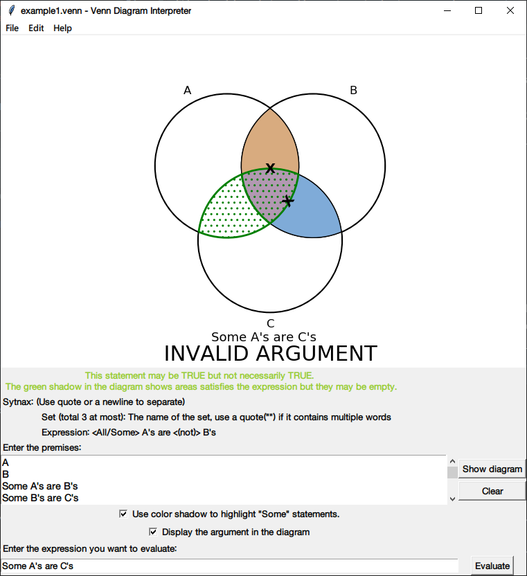
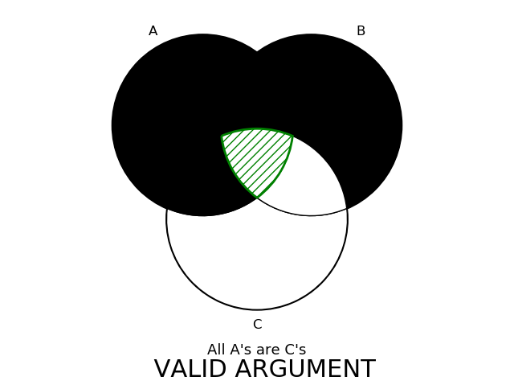

# VennDiagramInterpreter
### Overview
This is my undergraduate project. A simple program to parse, interpret, validate and visualize logic arguments using
Venn diagram

### Environment installation
```
conda install numpy
conda install matplotlib
conda install matplotlib-venn
```
Or if the system does not have ```conda```, then
```
pip install numpy
pip install matplotlib
pip install matplotlib-venn
```

### How to use: 
```
usage: venn_gui.py [-h] [-f FILENAME] [-e EVAL] [--no_window]
                   [--export EXPORT]

optional arguments:
  -h, --help            show this help message and exit
  -f FILENAME, --filename FILENAME
                        Read premises from local file
  -e EVAL, --eval EVAL  The argument being validated
  --no_window           Get the result immediately without showing the
                        interactive window (Need -f argument)
  --export EXPORT       Export the result to an image file (Need -f and
                        --no_window argument)

```
- filename: if specified, the program will read from the file automatically at startup.
- eval: if specified, the program will automatically validate the argument
- no_window: if specified, the program will display the result without the interpreter window
- export: if specified, the program will automatically save the diagram to an image file. 
          (Only available in no_window mode)

### Local file usage:
The file should contains all premises in logic arguments. 

### Syntax
The logic argument could be:
- Set (total 3 at most): The name of the set, use a quote("") if it contains multiple words or spaces
- Expression: <All/Some> A's are <(not)> B's
  <br> if the set name in the expression is not specified elsewhere, it will be added 
  automatically

Each element is separated by newline characters.

### Examples
```
cat example/example1.venn
```
A <br>
B <br>
Some A's are B's <br>
Some B's are C's <br>
C <br>
```
python venn_gui.py -f example/example1.venn --eval "Some A's are C's"
```

<br>
<br>
```
cat example/example2.venn
```
All A's are B's <br>
All B's are C's <br>
```
python venn_gui.py -f example/example2.venn --eval "All A's are C's" --no_window
```

